<div align="center">
  

# Kover

[](https://github.com/rodonisi/kover/actions/workflows/ci.yaml)
[](https://github.com/rodonisi/kover/actions/workflows/build-and-deploy.yml)
<a href="https://hosted.weblate.org/engage/kover/"></a>


An unofficial cross-platform [Kavita](https://www.kavitareader.com/) client.

</div>

## Overview

### Features

- Dedicated Kavita client, directly integrating with the Kavita API.
- Library synchronization with support for both streaming chapters, or downloading them for offline reading.
- ePub, image and PDF readers with support for various reading modes, navigation options and customizations.
- Reading progress stored locally and automatically synchronized with the server when a connection is available.
- Library browsing with support for filtering, sorting and searching.
- Built with Flutter with the goal of keeping all platforms supported, i.e. mobile, desktop and (because why not) web

## Getting Started

### Installation

#### iOS & MacOS

The app is available in open beta on TestFlight, which can be joined [here](https://testflight.apple.com/join/UsCtQUeY).

#### Android

The app is available in open beta on the Play Store, which can be joined [here](https://play.google.com/apps/testing/com.rodonisi.kover).
Thanks to everyone joining the closed beta and enabling Kover to apply for open beta! Releases will still be
pushed to the closed beta track, so there is no need for existing testers to swap tracks.

An APK build is also available in the [releases](https://github.com/rodonisi/kover/releases/latest) section of this repository.

#### Other platforms

The remainder platforms are currently not packaged automatically. It is planned setup pipelines for Windows, Linux and MacOS and push builds to the release page in the future.

For now, those could still be built from source for local use by following the instructions below.

### Building from Source

This project makes heavy use of code generation for APIs, model and database objects. The generated code is also not committed to the repository, so building from source requires a few extra steps:

- install dependencies with

  ```bash
  flutter pub get
  ```

- run build_runner to generate all annotated code

  ```bash
  dart run build_runner build --delete-conflicting-outputs
  ```

- finally the project can be built normally with `flutter build` or run in debug mode with `flutter run`

Note: remember to regenerate code when modifying annotated classes or run with `dart run build_runner watch
--delete-conflicting-outputs` during development to watch for changes.

#### Building Web

Web requires additional dependencies to be available, namely the Drift worker and Sqlite3.

A script that pulls the correct versions based on the `pubspec.lock` is available under `tools` and can be run with

```
dart run tools/fetch_web_dependencies.dart
```

**Note**: due to CORS, the web version has to be served on the same domain as Kavita, or put behind a reverse proxy setup to inject additional HTTP allow-origin headers for the desired domains. This is completely untested and no official guidance exists.

## Connecting to Kavita

To connect Kover to a Kavita instance:

- navigate to the app settings
- fill in the server URL
- retrieve or generate an API key for the desired user from the Kavita `Auth Keys / OPDS` settings page and fill it in the app settings. The OPDS key generated by default can also be used, or a new one can be generated specifically for Kover.

## Screenshots

### Library Navigation

<p align="center">
  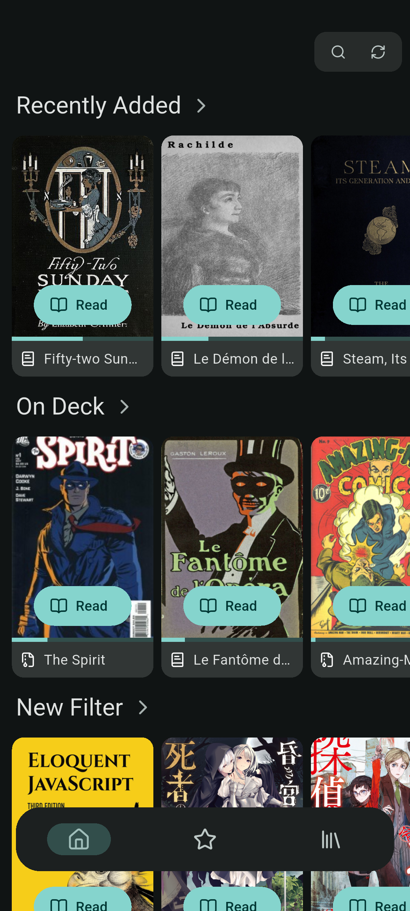
  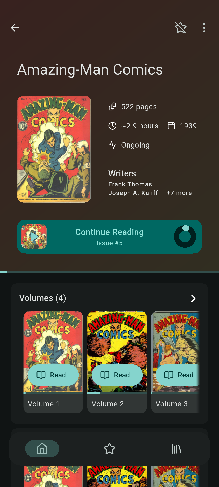
  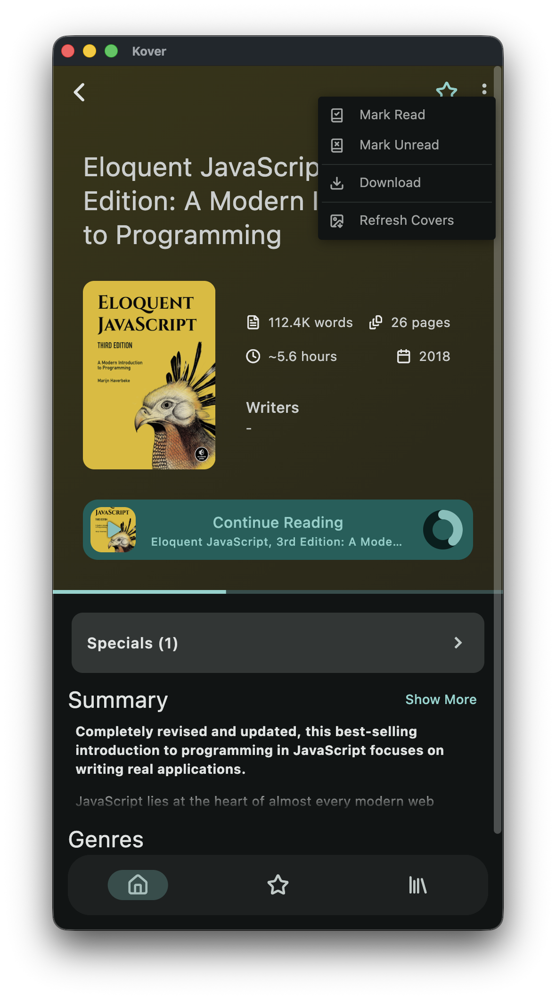
  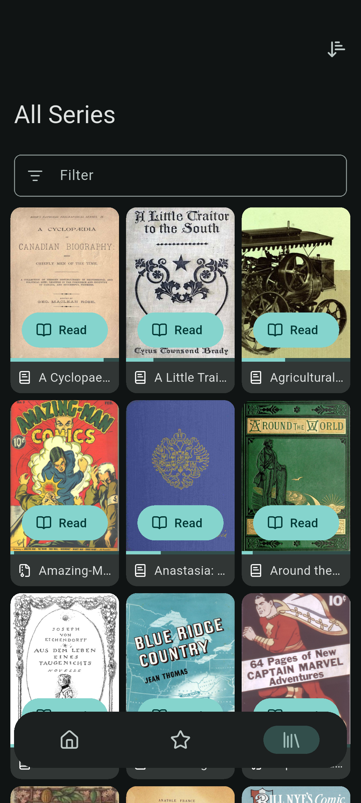
  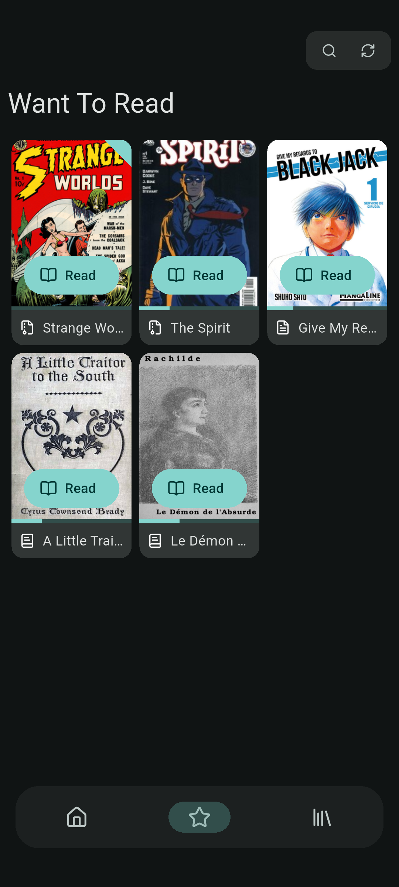
  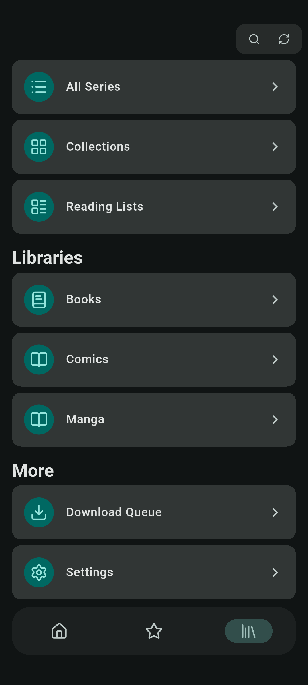
</p>

### Reading

<p align="center">
  
  
</p>

<p align="center">
  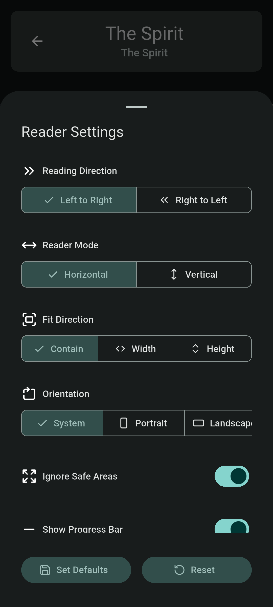
  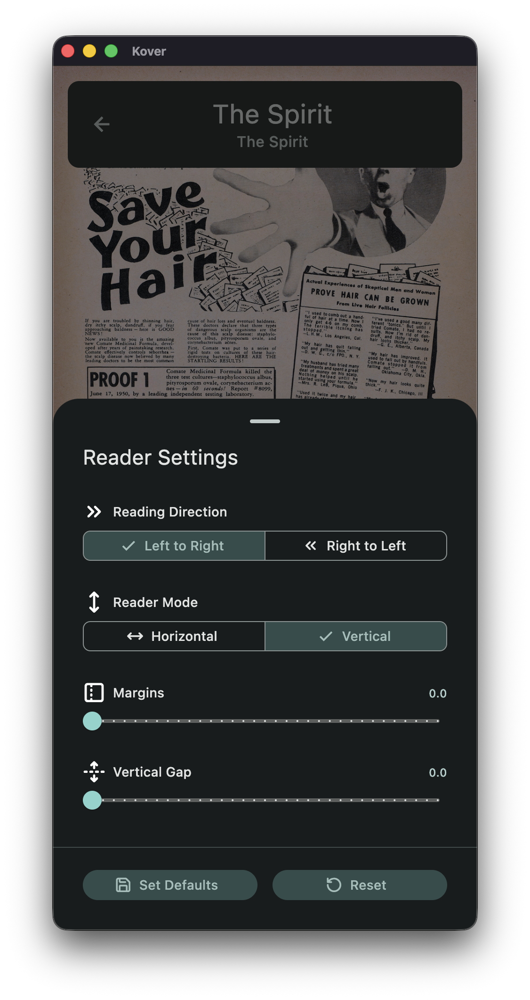
  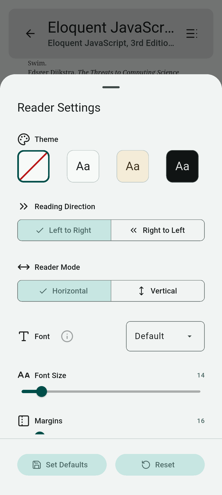
</p>

### Settings

<p align="center">
  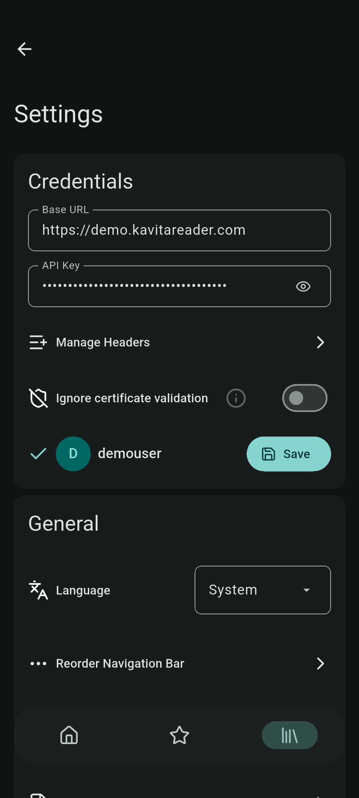
  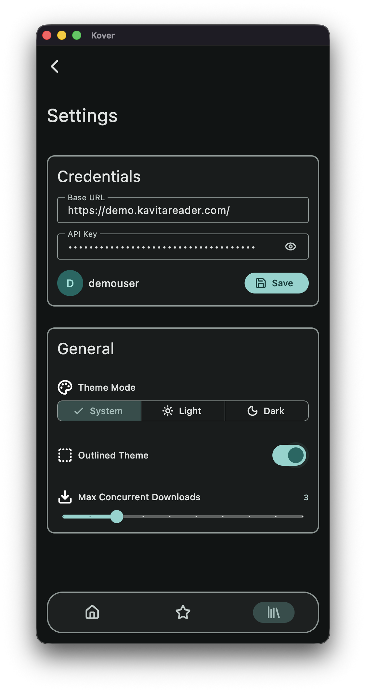
  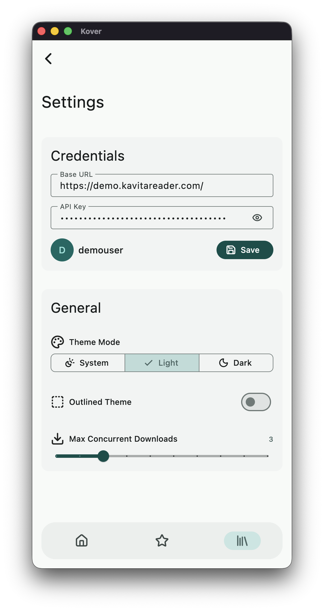
</p>

## Thanks

<a href="https://sentry.io/"><svg xmlns="http://www.w3.org/2000/svg" viewBox="0 0 222 66" width="101" height="30" aria-hidden="true" class="__sntry__"><defs><style type="text/css">@media (prefers-color-scheme: dark) {path.**sntry** { fill: #ffffff !important; }}</style></defs><path d="M29,2.26a4.67,4.67,0,0,0-8,0L14.42,13.53A32.21,32.21,0,0,1,32.17,40.19H27.55A27.68,27.68,0,0,0,12.09,17.47L6,28a15.92,15.92,0,0,1,9.23,12.17H4.62A.76.76,0,0,1,4,39.06l2.94-5a10.74,10.74,0,0,0-3.36-1.9l-2.91,5a4.54,4.54,0,0,0,1.69,6.24A4.66,4.66,0,0,0,4.62,44H19.15a19.4,19.4,0,0,0-8-17.31l2.31-4A23.87,23.87,0,0,1,23.76,44H36.07a35.88,35.88,0,0,0-16.41-31.8l4.67-8a.77.77,0,0,1,1.05-.27c.53.29,20.29,34.77,20.66,35.17a.76.76,0,0,1-.68,1.13H40.6q.09,1.91,0,3.81h4.78A4.59,4.59,0,0,0,50,39.43a4.49,4.49,0,0,0-.62-2.28Z M124.32,28.28,109.56,9.22h-3.68V34.77h3.73V15.19l15.18,19.58h3.26V9.22h-3.73ZM87.15,23.54h13.23V20.22H87.14V12.53h14.93V9.21H83.34V34.77h18.92V31.45H87.14ZM71.59,20.3h0C66.44,19.06,65,18.08,65,15.7c0-2.14,1.89-3.59,4.71-3.59a12.06,12.06,0,0,1,7.07,2.55l2-2.83a14.1,14.1,0,0,0-9-3c-5.06,0-8.59,3-8.59,7.27,0,4.6,3,6.19,8.46,7.52C74.51,24.74,76,25.78,76,28.11s-2,3.77-5.09,3.77a12.34,12.34,0,0,1-8.3-3.26l-2.25,2.69a15.94,15.94,0,0,0,10.42,3.85c5.48,0,9-2.95,9-7.51C79.75,23.79,77.47,21.72,71.59,20.3ZM195.7,9.22l-7.69,12-7.64-12h-4.46L186,24.67V34.78h3.84V24.55L200,9.22Zm-64.63,3.46h8.37v22.1h3.84V12.68h8.37V9.22H131.08ZM169.41,24.8c3.86-1.07,6-3.77,6-7.63,0-4.91-3.59-8-9.38-8H154.67V34.76h3.8V25.58h6.45l6.48,9.2h4.44l-7-9.82Zm-10.95-2.5V12.6h7.17c3.74,0,5.88,1.77,5.88,4.84s-2.29,4.86-5.84,4.86Z" transform="translate(11, 11)" fill="#181225" class="__sntry__"></path></svg></a>

[Sentry](https://sentry.io/) for providing an open source license for their error reporting software..
